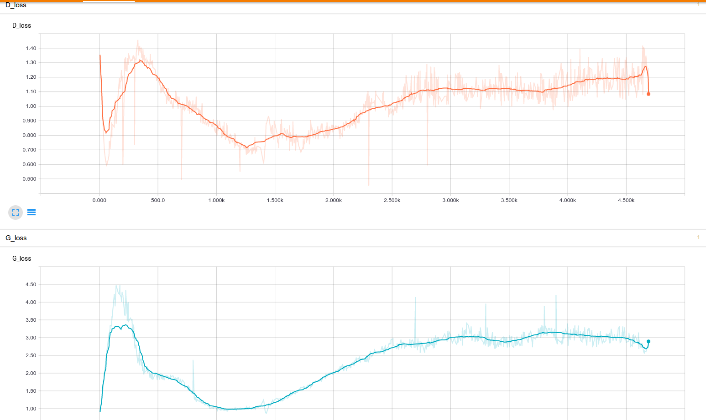
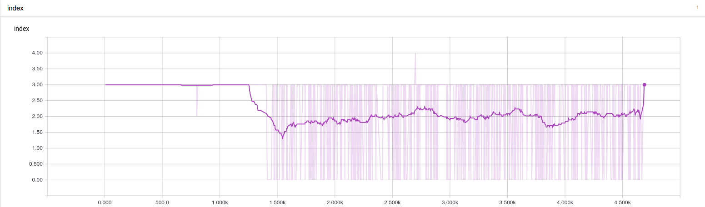
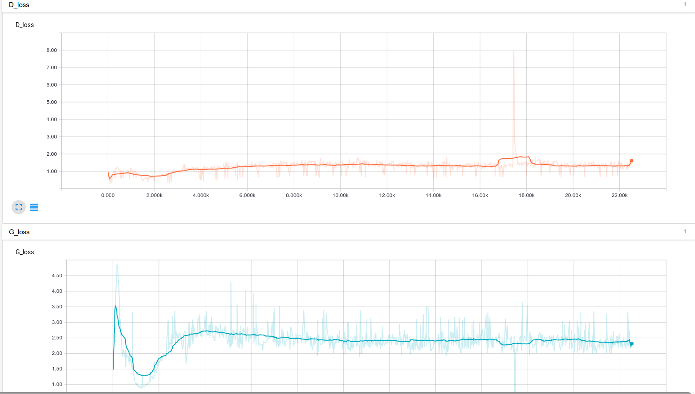
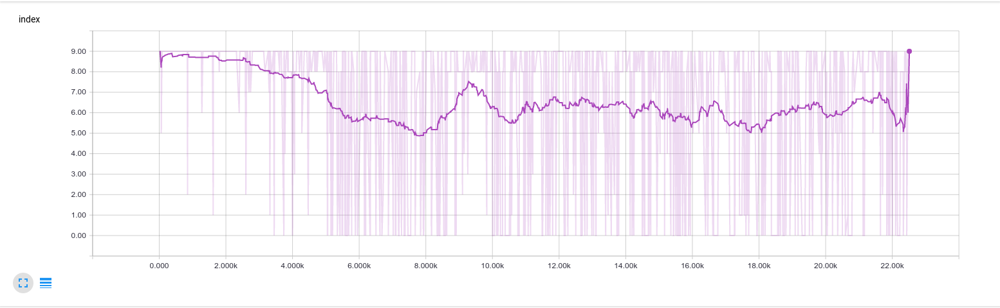

# updates for mygans
> gans更新记录

## Updates - master
Recode updates everyday.

* **created**: create files from 0-1
* **add**: add new to origin
* **changed**: change somethings
* **move**: move files/funcs from path1 to path2
* **fixed**: fix bugs

### 2017-4-10

* in ./G/netG.py - **add** note for def
* in ./util/network_util.py - **add** def create_nets
* in ./train.py - **create** mutil nets by using create_nets
* in README.md - **create** this markdown file

### 2017-4-11

* in ./util/network_util.py - **add** def create_optims and create_couple_optims
* in ./util/network_util.py - **add** def init_networks
* in ./util/solver_util.py - **create** this file, and **move** create_optims and create_couple_optims to this file
* in ./util/train_util.py - **create** this file, and **add** def create_netG_indeps and netD_fake
* in ./train.py - **add** G_share_solver, G_indep_solver, G_solvers

### 2017-4-12

* in ./util/train_util.py - **add** def find_best_netG and def compute_loss
* in ./util/train_util.py - **change** def create_netG_indeps to def create_netG_samples
* in ./util/network_util.py - **change** def weight_init to suit mutil kinds of netG

### 2017-4-14

**tips:**pytorch-tips updates showed in [Pytorch-learnBooks](https://github.com/JiangWeixian/Pytorch-LearnBooks)

* in ./util/solver_util.py - **add** def create_couple2one_optims

### 2017-4-17

G_solvers : mutil (netG_indep_solver + netG_share_solver) not be used

* in ./util/train_util.py - **add** def mutil_backward
* in ./util/train_util.py - **add** def mutil_steps
* in ./train.py - **add** plt.imshow and net.save, **add** iteration

### 2017-4-18

use totchvision in pytorch is better, so **changed** load data way!

* in ./train_mnist_tf.py - **changed** train.py to train_mnist_tf.py
* in ./train_mnist_pytorch.py - **add** train_mnist_pytorch.py

### 2017-4-22

find some bugs.

* in ./util/vision_util.py&./util/train_util.py, ./train_mnist_pytorch.py&train_mnist_tf.py - **fixed** bugs
* bugs - init network as same mean&var will be better

but the problem is that the index of best netG didn't changed over training! So, the best netG_indep always is best, don't change anymore! 

Because of init?

### 2017-4-24

I find that gans's examples in pytorch, always netD.step(), then calculate the prob of fake again, then netG.step().In other words, gan's examples calculate the prob of fake twice. But in branch master, I always calculate the fake only once.So

* in ./util/train_util.py - **changed** the order of step() and backward() in def mutil_backward&mutil_steps
* in ./train_mnist_pytorch.py - **changed** calculate netG's loss twice

### 2017-4-25

* ./train_mnist_pytorch.py - **add** z.data.resize_(mb_size, z_dim).normal_(0, 1) in if it % 2 ==0:

### 2017-4-26

* in train_mnist_pytorch.py - this project don't work

### 2017-4-27

* in train_mnist_pytorch.py - **changed** batch-size=64 to 1
* in train_util.py - **change** log(1 - D(G(z))) to BCEloss in **def compute_dloss and compute gloss**

But still not working!

### 2017-5-11

* in train_mnist_pytorch.py - **changed** batch_size from 64 to 1, wait for verified!

## Updates - v1.0
Recode updates everyday.

* **created**: create files from 0-1
* **add**: add new to origin
* **changed**: change somethings
* **move**: move files/funcs from path1 to path2
* **fixed**: fix bugs

### 2017-4-24

* in ./D/cfg.py&./D/netD.py and ./G/cfg.py&./G/netG.py - **add** def create_convnets_G&create_convnets_D to bulid dcgans

I find that gans's examples in pytorch, always netD.step(), then calculate the prob of fake again, then netG.step().In other words, gan's examples calculate the prob of fake twice. But in branch master, I always calculate the fake only once.

### 2017-4-25

* ./train_pix2pix_pytorch.py -**add** x.data.resize_... to suit mnist datasets, and crayon
* ./train_pix2pix_pytorch.py - **change** def weight_init to suit conv's network

### 2017-4-26

the code(normalized in dataloader) will destory training! So just remove it in all files! **and** we try my ten coupled gans after that!

* ./train_vanillgan_pytorch.py&./train_vanillgan_pytorch.py - **created** those files, complete training vanillgans, test gans in load_state_stict()
* ./train_chanierdcgan_mnist_pytorch.py&./train_dcgan_mnist_pytorch.py - **created** those files, want train mnist datasets in dcgans
* ./test_mnist_dcgan.py - **created** this file, and netG and netD based on chanier-gans
* ./D/cfg.py&./G/cfg.py - **add** dcgans, chainer-gans's arch

### 2017-4-28

* in ./train_chanierdcgan_mnist_pytorch.py - it does work for mnist! 
* in ./train_dcgan_mnist_pytorch.py - **delete** this file, it doesn't work

### 2017-5-5

Use nn.BCEloss, rather than **-(torch.mean(torch.log(D_real)) + torch.mean(torch.log(1 - D_fake)))** Somethimes,  the after One will have a mistake! So use offical loss funcs!

* in ./train_dcgan_cifar10_pytorch.py - **changed** learning rate, because lr=1e-3, the dloss and gloss can't become down!, and **add** netD.zero_grad()

### 2017-5-6

if dloss = errReal + errFake, errReal.backward() and errFake.backward() is better than dloss.backward()!

* in ./train_mnist_pytorch_v1dot1.py - **created** this file, and test what i find! 

### 2017-5-16

* planA(master version) - take lower layer as indeps
* planB(v1.0) - take higher layer as indeps

all plan can't output good results, so maybe the way update network is not right! So change another way!

if i load already trained netD networks, and netG is **new**! the loss of netG wiil not decline. 

v1.0 version is done(not successfully!!)!

## Updates - v1.0
Recode updates everyday.

* **created**: create files from 0-1
* **add**: add new to origin
* **changed**: change somethings
* **move**: move files/funcs from path1 to path2
* **fixed**: fix bugs

### 2017-5-17

* in ./GAN/competitiongan.py - **created** this file, for new idea! and complete funcs
* in ./train_competition_gan.py - **created** this file, train competition gans!
* in ./GAN/competitiongan.py - **fixed** bugs in save networks, and save images
* in ./GAN/competitiongan.py & in ./train_competition_gan.py - **add** random index choice in parser each display_it

now, competiton gan is got result!

### 2017-5-18

train competition gan:

* 5 netG network, no random index, the loss and index showed belowed:
    * 
    * 
* 10 netG network, random index choice by each **ten iters**, the loss and index showed belowed:
    * 
    * 

### 2017-5-19

always use the max prob of mean(netG) as my rule to choose the index of netG.Use another rule:

* approach the prob of real img(x), as my the rule of choose index of best netG

### 2017-5-21

* in ./GAN/competitiongan.py - **add** find_best_netGv1dot2

### 2017-5-22

* train competitiongan.py in find_best_netG version1.2, didn't work well as v1.0

### 2017-5-23

* remove D_lambda in netD loss look like normal, because never see add extra loss in netD loss, may it's version 1.3!
* in ./GAN/competition_dcgan.py - **created** this file, add dcgan mode!(not test)
* in ./GAN/competition_pix2pix.py - **created** this file, add pix2pix mode!(not test)

### 2017-5-24

* however, the competitionganv1.3(change netD loss) work not work well, is worse one!
* v1.1/v1.2 mean find_best_netG way is different, so those work simlarly, but v1.1 will better!

### 2017-5-16

* in all competition_gan.py files - **fixed** bugs, take self.D_fake to competue loss in backward_G

### 2017-7-21

* in all files - **changed** doc string

### 2017-7-23

* in ./GAN/competition_gan3_2.py - **changed** self.savepath into self.savepath + self.gans_type 

## Test-CompetitionGAN

### v1.3

* before fix bugs or not, bad result!

### v1.4

test competitiongan v1.4, import netG pth(high epoch), see what kind of result output~

1. ./result/competitionganv1.4/out/netG6_epoch_3400.pth - 1
2. ./result/competitionganv1.4/out/netG0_epoch_4600.pth - 9
3. ./result/competitionganv1.4/out/netG0_epoch_4000.pth - 9
4. ./result/competitionganv1.4/out/netG5_epoch_4200.pth - 1

之后又输入了几个`.pth`文件，发现大多数生成网络都是输出了数字1，少数是数字9。

虽然部分达到了我们希望的分类器的目的（因为相同网络的不同`epoch`的`.pth`文件输出相同的数字），但是，多样性少了很多。这显然是不对的。

before fix or not, result not change too mush!

v1.4 still modified!!

### v1.4.1

* result is more worst, because output only became number 1
* if we choose anthoer epoch (4600/1100), 4600's all netG output same number, and 1300's all neG output anther same number!

### v1.4.4

* very bad result = no result
    * v1.4.1 - add lambda into netG. but index don't change